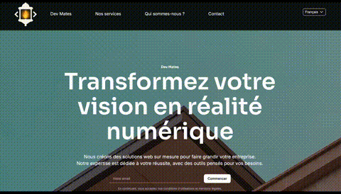
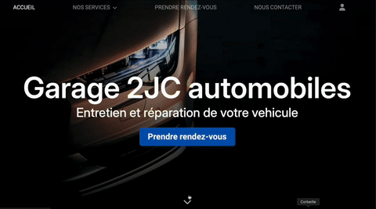
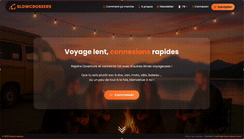

# Hello everyone 👋

Hi, I’m Manon ! I’m a **freelance web developer** and the founder of **Digital MC**, passionate about creating seamless web experiences.

## 🛠️ Tech Stack

## 💻 Last Projects

You can check out my work here on GitHub.  

### 🌐 Dev Mates

A collaborative project aimed at designing and developing a personal portfolio website. Focused on clean, responsive design and modern web development best practices, showcasing skills, projects, and professional experience in a clear and engaging way.

[Click here for see the website online.](https://dev-mates.com)

### 🚗 2JC Automobiles  

A complete web solution for a car dealership, including a showcase website presenting available vehicles and services, as well as a full management application for vehicle inventory and appointments. This project demonstrates both front-end and back-end skills, providing a seamless user experience for customers and staff alike.

[Click here for see the repository.](https://github.com/mchapelle67/projet2JC) | [Click here for see the website online.](https://2jc-automobiles.fr)

### 🚐 SLOWCROSSERS 
A social platform designed for digital nomads to connect, including features such as friends maps to see where connections are around the world, instant messaging for real-time communication, friend's requests ...
This is the biggest project I’ve worked on during my internship, developed in collaboration with @marineWF3 as her student.

[Click here for see the website online.](https://www.slowcrossers.com)

## 📫 Contact me

📧 **Mail** : manon.chp68@gmail.com

🌐 **LinkedIn** : [@manon-chapelle67](https://www.linkedin.com/in/manon-chapelle67/) | [Digital MC](https://www.linkedin.com/company/digital-mc68)

